 

[Christianjameshart.com](https://Christianjameshart.com) · [instagram](https://www.instagram.com/christianjames270/) · [linkedin](https://www.linkedin.com/in/christian-hart-a0442136b) · [email](mailto:christian@pursuetech.com)

> Developer based in Southern California, currently at Pursue Tech.
> Came up through Bethel Tech's coding program — now building in Python, TypeScript, and JavaScript.

Still early in the journey and building a range of small, practical tools —
from computer vision experiments to web utilities — while leveling up on
full-stack fundamentals.

`python typescript javascript html css git`

**[hand-estimation](https://github.com/ChristianjHart/hand-estimation)** · `python`
Hand pose/gesture estimation experiment.

**[Chem-Website](https://github.com/ChristianjHart/Chem-Website)** · `javascript`
A chemistry site built to help with homework.

**[yttmp3](https://github.com/ChristianjHart/yttmp3)** · `python`
A YouTube-to-MP3 conversion tool.

  

Every graphic here is generated, not embedded from anyone else's server.
`ascii.svg` is a photo pushed through a character ramp; the stat graphics and
these section headings are drawn by [a scheduled action](.github/workflows/stats.yml)
straight from the GitHub GraphQL API, once a day, committing only what changed.

They animate with SMIL inside the SVG, because GitHub strips scripts from
READMEs — and since nothing loads from a third party, nothing here can
rate-limit or go dark. The headings are SVGs for the same reason: GitHub also
strips CSS, so an image is the only way to put this page's own typeface on
them. See [SETUP.md](SETUP.md) for how to stand this up under your own
username.
